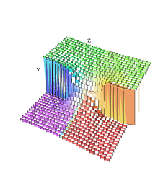

.. status: ok

1.16 Graphics
-------------

FriCAS has a two- and three-dimensional drawing and rendering graphics
package that allows you to draw, shade, color, rotate, translate, map,
clip, scale and combine graphic output of FriCAS computations. The
graphics interface is capable of plotting functions of one or more
variables and plotting parametric surfaces. Once the graphics figure
appears in a window, move your mouse to the window and click. A control
panel appears immediately and allows you to interactively transform the
object.

This is an example of FriCAS's two-dimensional plotting. From the 2D
Control Panel you can rescale the plot, turn axes and units on and off
and save the image, among other things. This PostScript image was
produced by clicking on the PS 2D Control Panel button.

::
    
  draw(cos(5*t/8), t=0..16*%pi, coordinates==polar)

|image1|        

.. math::

   J_0(\sqrt{x^2+y^2}),\,\,\, -20\leq x,y \leq 20

   
This is an example of FriCAS's three-dimensional plotting. It is a
monochrome graph of the complex arctangent function. The image displayed
was rotated and had the shade and outline display options set from the
3D Control Panel. The PostScript output was produced by clicking on the
save 3D Control Panel button and then clicking on the PS button. See
Section `ugProblemNumeric <section-8.1.html#ugProblemNumeric>`__ for
more details and examples of FriCAS's numeric and graphics capabilities.

::
    
  draw((x,y) +-> real atan complex(x,y), -%pi..%pi, -%pi..%pi, _
        colorFunction == (x,y) +-> argument atan complex(x,y))

|image3|                                                                 

.. math::

  \arctan(x+ i\,y),\,\, -\pi\leq x,y \, \leq \pi

An exhibit of FriCAS images is given later. For a description of the
commands and programs that produced these figures, see
`ugAppGraphics <section-21.0.html#ugAppGraphics>`__ . PostScript
PostScript output is available so that FriCAS images can be
printed.PostScript is a trademark of Adobe Systems Incorporated,
registered in the United States. See
`ugGraph <section-7.0.html#ugGraph>`__ for more examples and details
about using FriCAS's graphics facilities.

This concludes your tour of FriCAS. To disembark, issue the system
command )quit to leave FriCAS and return to the operating system.

.. |image1| image:: ps/P28a.png 

