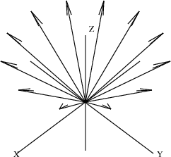

.. status: ok

10.5 A Bouquet of Arrows
------------------------

Let's draw a bouquet of arrows. Each arrow is identical. The arrowheads
are uniformly placed on a circle parallel to the xy-plane. Thus the
position of each arrow differs only by the angle θ, 0≤θ<2π, between the
arrow and the x-axis on the xy-plane.

Our bouquet is rather special: each arrow has a different color (which
won't be evident here, unfortunately). This is arranged by letting the
color of each successive arrow be denoted by θ. In this way, the color
of arrows ranges from red to green to violet. Here is a program to draw
a bouquet of n arrows.

.. spadVerbatim

::

 drawBouquet(n,title) ==}{}
   angle := 0.0@DFLOAT                          The initial angle
   sp := createThreeSpace()                     Create empty space $sp$

  for i in 0..n-1 repeat                       For each index i, create:
     start := point [0.0@DFLOAT,0.0@DFLOAT,0.0@DFLOAT,angle] 

                                               the point at base of arrow;
     end   := point [cos angle, sin angle, 1.0@DFLOAT, angle]

                                               the point at tip of arrow;
     arrow := makeArrow(start,end)              the $i$th arrow

    for a in makeArrow(start,end) repeat       For each arrow component,

      curve(sp,a)                              add the component to $sp$
     angle := angle + 2*%pi/n                  The next angle

  makeViewport3D(sp,title)                     Create the viewport from $sp$

Read the input file.

.. spadInput
::

	)read bouquet

.. spadMathAnswer
A bouquet of a dozen arrows.

drawBouquet(12,"A Dozen Arrows")

|picture|

