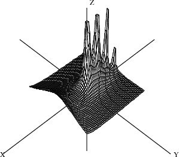

.. status: ok

11.6 Compiling Packages
-----------------------

Once you have defined the package DrawComplex, you need to compile and
test it. To compile the package, issue the system command )compile
drawpak. FriCAS reads the file drawpak.spad and compiles its contents
into machine binary. If all goes well, the file DRAWCX.NRLIB is created
in your local directory for the package. To test the package, you must
load the package before trying an operation.

Compile the package.

.. spadInput
::

	)compile drawpak

.. spadMathAnswer
Expose the package.

.. spadInput
::

	)expose DRAWCX

.. spadMathAnswer
Use an odd step size to avoid a pole at the origin.

.. spadInput
::

	setRealSteps 51

.. spadMathAnswer
.. spadInput
::

	setImagSteps 51

.. spadMathAnswer
Define f to be the Gamma function.

.. spadInput
::

	f(z) == Gamma(z)

.. spadMathAnswer
Clip values of function with magnitude larger than 7.

.. spadInput
::

	setClipValue 7

.. spadMathAnswer
Draw the Gamma function.

drawComplex(f,-%pi..%pi,-%pi..%pi, false)

|picture|

