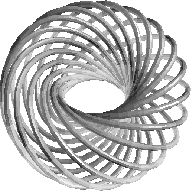

.. status: ok

7.0 Graphics
------------

|picture|

Torus knot of type (15,17).

This chapter shows how to use the FriCAS graphics facilities graphics
under the X Window System. FriCAS has two-dimensional and
three-dimensional drawing and rendering packages that allow the drawing,
coloring, transforming, mapping, clipping, and combining of graphic
output from FriCAS computations. This facility is particularly useful
for investigating problems in areas such as topology. The graphics
package is capable of plotting functions of one or more variables or
plotting parametric surfaces and curves. Various coordinate systems are
also available, such as polar and spherical.

A graph is displayed in a viewport window and it has a viewport
control-panel that uses interactive mouse commands. PostScript and other
output forms are available so that FriCAS PostScript images can be
printed or used by other programs.

