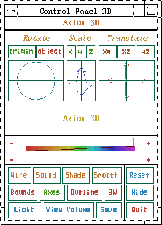

.. status: ok

7.2 Three-Dimensional Graphics
------------------------------

The FriCAS three-dimensional graphics package provides the ability to
graphics:three-dimensional

-  generate surfaces defined by a function of two real variables
-  generate space curves and tubes defined by parametric equations
-  generate surfaces defined by parametric equations

These graphs can be modified by using various options, such as
calculating points in the spherical coordinate system or changing the
polygon grid size of a surface.

7.2.1 Plotting Three-Dimensional Functions of Two Variables
~~~~~~~~~~~~~~~~~~~~~~~~~~~~~~~~~~~~~~~~~~~~~~~~~~~~~~~~~~~

surface:two variable function The simplest three-dimensional graph is
that of a surface defined by a function of two variables, z=f(x,y).

The general format for drawing a surface defined by a formula f(x,y) of
two variables x and y is:

draw(f(x,y), x = a..b, y = c..d, options)

| where a..b and c..d define the range of x and y, and where options
prescribes zero or more options as described in
`ugGraphThreeDOptions <section-7.2.html#ugGraphThreeDOptions>`__ . An
example of an option is title=="TitleofGraph". An alternative format
involving a function f is also available.

The simplest way to plot a function of two variables is to use a
formula. With formulas you always precede the range specifications with
the variable name and an = sign.

draw(cos(x*y),x=-3..3,y=-3..3)

If you intend to use a function more than once, or it is long and
complex, then first give its definition to FriCAS.

.. spadInput
::

	f(x,y) == sin(x)*cos(y)

.. spadMathAnswer
.. spadType

:sub:`Type: Void`

To draw the function, just give its name and drop the variables from the
range specifications. FriCAS compiles your function for efficient
computation of data for the graph. Notice that FriCAS uses the text of
your function as a default title.

draw(f,-%pi..%pi,-%pi..%pi)

7.2.2 Plotting Three-Dimensional Parametric Space Curves
~~~~~~~~~~~~~~~~~~~~~~~~~~~~~~~~~~~~~~~~~~~~~~~~~~~~~~~~

A second kind of three-dimensional graph is a three-dimensional space
curve curve:parametric space defined by the parametric equations for
x(t), y(t), parametric space curve and z(t) as a function of an
independent variable t.

The general format for drawing a three-dimensional space curve defined
by parametric formulas x=f(t), y=g(t), and z=h(t) is:

draw(curve(f(t),g(t),h(t)), t = a..b, options)

| where a..b defines the range of the independent variable t, and where
options prescribes zero or more options as described in
`ugGraphThreeDOptions <section-7.2.html#ugGraphThreeDOptions>`__ . An
example of an option is title=="TitleofGraph". An alternative format
involving functions f, g and h is also available.

If you use explicit formulas to draw a space curve, always precede the
range specification with the variable name and an = sign.

draw(curve(5*cos(t), 5*sin(t),t), t=-12..12)

Alternatively, you can draw space curves by referring to functions.

.. spadInput
::

	i1(t:DFLOAT):DFLOAT == sin(t)*cos(3*t/5)

.. spadMathAnswer
.. spadVerbatim

::

    Function declaration i1 : DoubleFloat -> DoubleFloat has been added 
       to workspace.

.. spadType

:sub:`Type: Void`

This is useful if the functions are to be used more than once ...

.. spadInput
::

	i2(t:DFLOAT):DFLOAT == cos(t)*cos(3*t/5)

.. spadMathAnswer
.. spadVerbatim

::

    Function declaration i2 : DoubleFloat -> DoubleFloat has been added 
       to workspace.

.. spadType

:sub:`Type: Void`

or if the functions are long and complex.

.. spadInput
::

	i3(t:DFLOAT):DFLOAT == cos(t)*sin(3*t/5)

.. spadMathAnswer
.. spadVerbatim

::

    Function declaration i3 : DoubleFloat -> DoubleFloat has been added 
       to workspace.

.. spadType

:sub:`Type: Void`

Give the names of the functions and drop the variable name specification
in the second argument. Again, FriCAS supplies a default title.

draw(curve(i1,i2,i3),0..15*%pi)

7.2.3 Plotting Three-Dimensional Parametric Surfaces
~~~~~~~~~~~~~~~~~~~~~~~~~~~~~~~~~~~~~~~~~~~~~~~~~~~~

surface:parametric A third kind of three-dimensional graph is a surface
defined by parametric surface parametric equations for x(u,v), y(u,v),
and z(u,v) of two independent variables u and v.

The general format for drawing a three-dimensional graph defined by
parametric formulas x=f(u,v), y=g(u,v), and z=h(u,v) is:

draw(surface(f(u,v),g(u,v),h(u,v)), u = a..b, v = c..d, options)

| where a..b and c..d define the range of the independent variables u
and v, and where options prescribes zero or more options as described in
`ugGraphThreeDOptions <section-7.2.html#ugGraphThreeDOptions>`__ . An
example of an option is title=="TitleofGraph". An alternative format
involving functions f, g and h is also available.

This example draws a graph of a surface plotted using the parabolic
cylindrical coordinate system option. coordinate system:parabolic
cylindrical The values of the functions supplied to surface are
parabolic cylindrical coordinate system interpreted in coordinates as
given by a coordinates option, here as parabolic cylindrical coordinates
(see `ugGraphCoord <section-7.2.html#ugGraphCoord>`__ ).

draw(surface(u*cos(v), u*sin(v), v*cos(u)), u=-4..4, v=0..%pi,
coordinates== parabolicCylindrical)

Again, you can graph these parametric surfaces using functions, if the
functions are long and complex.

Here we declare the types of arguments and values to be of type
DoubleFloat.

.. spadInput
::

	n1(u:DFLOAT,v:DFLOAT):DFLOAT == u*cos(v)

.. spadMathAnswer
.. spadVerbatim

::

    Function declaration n1 : DoubleFloat -> DoubleFloat has been added 
       to workspace.

.. spadType

:sub:`Type: Void`

As shown by previous examples, these declarations are necessary.

.. spadInput
::

	n2(u:DFLOAT,v:DFLOAT):DFLOAT == u*sin(v)

.. spadMathAnswer
.. spadVerbatim

::

    Function declaration n2 : DoubleFloat -> DoubleFloat has been added 
       to workspace.

.. spadType

:sub:`Type: Void`

In either case, FriCAS compiles the functions when needed to graph a
result.

.. spadInput
::

	n3(u:DFLOAT,v:DFLOAT):DFLOAT == u

.. spadMathAnswer
.. spadVerbatim

::

    Function declaration n3 : DoubleFloat -> DoubleFloat has been added 
       to workspace.

.. spadType

:sub:`Type: Void`

Without these declarations, you have to suffix floats with @DFLOAT to
get a DoubleFloat result. However, a call here with an unadorned float
produces a DoubleFloat.

.. spadInput
::

	n3(0.5,1.0)

.. spadMathAnswer
.. spadVerbatim

::

    Compiling function n3 with type (DoubleFloat,DoubleFloat) -> 
       DoubleFloat 

.. spadType

:sub:`Type: DoubleFloat`

Draw the surface by referencing the function names, this time choosing
the toroidal coordinate system. coordinate system:toroidal toroidal
coordinate system

draw(surface(n1,n2,n3), 1..4, 1..2*%pi, coordinates ==
toroidal(1$DFLOAT))

7.2.4 Three-Dimensional Options
~~~~~~~~~~~~~~~~~~~~~~~~~~~~~~~

graphics:3D options The draw commands optionally take an optional list
of options such as coordinates as shown in the last example. Each option
is given by the syntax: name == value. Here is a list of the available
options in the order that they are described below:

+-----------------+---------------+-------------+
| title           | coordinates   | var1Steps   |
+-----------------+---------------+-------------+
| style           | tubeRadius    | var2Steps   |
+-----------------+---------------+-------------+
| colorFunction   | tubePoints    | space       |
+-----------------+---------------+-------------+

The option title gives your graph a title. graphics:3D options:title

draw(cos(x*y),x=0..2*%pi,y=0..%pi,title == "Title of Graph")

The style determines which of four rendering algorithms is used for
rendering the graph. The choices are "wireMesh", "solid", "shade", and
"smooth".

draw(cos(x*y),x=-3..3,y=-3..3, style=="smooth", title=="Smooth Option")

In all but the wire-mesh style, polygons in a surface or tube plot are
normally colored in a graph according to their z-coordinate value. Space
curves are colored according to their parametric variable value.
graphics:3D options:color function To change this, you can give a
coloring function. function:coloring The coloring function is sampled
across the range of its arguments, then normalized onto the standard
FriCAS colormap.

A function of one variable makes the color depend on the value of the
parametric variable specified for a tube plot.

.. spadInput
::

	color1(t) == t

.. spadMathAnswer
.. spadType

:sub:`Type: Void`

draw(curve(sin(t), cos(t),0), t=0..2*%pi, tubeRadius == .3,
colorFunction == color1)

A function of two variables makes the color depend on the values of the
independent variables.

.. spadInput
::

	color2(u,v) == u^2 - v^2

.. spadMathAnswer
.. spadType

:sub:`Type: Void`

Use the option colorFunction for special coloring.

draw(cos(u*v), u=-3..3, v=-3..3, colorFunction == color2)

With a three variable function, the color also depends on the value of
the function.

.. spadInput
::

	color3(x,y,fxy) == sin(x*fxy) + cos(y*fxy)

.. spadMathAnswer
.. spadType

:sub:`Type: Void`

draw(cos(x*y), x=-3..3, y=-3..3, colorFunction == color3)

Normally the Cartesian coordinate system is used. Cartesian:coordinate
system To change this, use the coordinates option. coordinate
system:Cartesian For details, see
`ugGraphCoord <section-7.2.html#ugGraphCoord>`__ .

.. spadInput
::

	m(u:DFLOAT,v:DFLOAT):DFLOAT == 1

.. spadMathAnswer
.. spadVerbatim

::

    Function declaration m : (DoubleFloat,DoubleFloat) -> DoubleFloat 
       has been added to workspace.

.. spadType

:sub:`Type: Void`

Use the spherical spherical coordinate system coordinate system.
coordinate system:spherical

draw(m, 0..2*%pi,0..%pi, coordinates == spherical, style=="shade")

Space curves may be displayed as tubes with polygonal cross sections.
tube Two options, tubeRadius and tubePoints, control the size and shape
of this cross section.

The tubeRadius option specifies the radius of the tube that tube:radius
encircles the specified space curve.

draw(curve(sin(t),cos(t),0),t=0..2*%pi, style=="shade", tubeRadius ==
.3)

The tubePoints option specifies the number of vertices tube:points in
polygon defining the polygon that is used to create a tube around the
specified space curve. The larger this number is, the more cylindrical
the tube becomes.

draw(curve(sin(t), cos(t), 0), t=0..2*%pi, style=="shade", tubeRadius
== .25, tubePoints == 3)

graphics:3D options:variable steps

Options var1Stepsvar1StepsDrawOption and var2Stepsvar2StepsDrawOption
specify the number of intervals into which the grid defining a surface
plot is subdivided with respect to the first and second parameters of
the surface function(s).

draw(cos(x*y),x=-3..3,y=-3..3, style=="shade", var1Steps == 30,
var2Steps == 30)

The space option of a draw command lets you build multiple graphs in
three space. To use this option, first create an empty three-space
object, then use the space option thereafter. There is no restriction as
to the number or kinds of graphs that can be combined this way.

Create an empty three-space object.

.. spadInput
::

	s := create3Space()$(ThreeSpace DFLOAT)

.. spadMathAnswer
.. spadMathOutput
.. math::

+--------------------------+
| 3-Spacewith0components   |
+--------------------------+

.. spadType

:sub:`Type: ThreeSpace DoubleFloat`

.. spadInput
::

	m(u:DFLOAT,v:DFLOAT):DFLOAT == 1

.. spadMathAnswer
.. spadVerbatim

::

    Function declaration m : (DoubleFloat,DoubleFloat) -> DoubleFloat 
       has been added to workspace.

.. spadType

:sub:`Type: Void`

Add a graph to this three-space object. The new graph destructively
inserts the graph into s.

draw(m,0..%pi,0..2*%pi, coordinates == spherical, space == s)

Add a second graph to s.

v := draw(curve(1.5*sin(t), 1.5*cos(t),0), t=0..2*%pi, tubeRadius ==
.25, space == s)

A three-space object can also be obtained from an existing
three-dimensional viewport using the subspacesubspaceThreeSpace command.
You can then use makeViewport3D to create a viewport window.

Assign to subsp the three-space object in viewport v.

.. spadInput
::

	subsp := subspace v

.. spadMathAnswer
Reset the space component of v to the value of subsp.

.. spadInput
::

	subspace(v, subsp)

.. spadMathAnswer
Create a viewport window from a three-space object.

makeViewport3D(subsp,"Graphs")

7.2.5 The makeObject Command
~~~~~~~~~~~~~~~~~~~~~~~~~~~~

An alternate way to create multiple graphs is to use makeObject. The
makeObject command is similar to the draw command, except that it
returns a three-space object rather than a ThreeDimensionalViewport. In
fact, makeObject is called by the draw command to create the ThreeSpace
then makeViewport3DmakeViewport3DThreeDimensionalViewport to create a
viewport window.

.. spadInput
::

	m(u:DFLOAT,v:DFLOAT):DFLOAT == 1

.. spadMathAnswer
.. spadVerbatim

::

    Function declaration m : (DoubleFloat,DoubleFloat) -> DoubleFloat 
       has been added to workspace.

.. spadType

:sub:`Type: Void`

Do the last example a new way. First use makeObject to create a
three-space object sph.

.. spadInput
::

	sph := makeObject(m, 0..%pi, 0..2*%pi, coordinates==spherical)

.. spadMathAnswer
.. spadVerbatim

::

    Compiling function m with type (DoubleFloat,DoubleFloat) -> 
       DoubleFloat 

.. spadMathOutput
.. math::

+-------------------------+
| 3-Spacewith1component   |
+-------------------------+

.. spadType

:sub:`Type: ThreeSpace DoubleFloat`

Add a second object to sph.

.. spadInput
::

	makeObject(curve(1.5*sin(t), 1.5*cos(t), 0), t=0..2*%pi, space ==
sph, tubeRadius == .25)

.. spadMathAnswer
.. spadVerbatim

::

    Compiling function %D with type DoubleFloat -> DoubleFloat 
    Compiling function %F with type DoubleFloat -> DoubleFloat 
    Compiling function %H with type DoubleFloat -> DoubleFloat 

.. spadMathOutput
.. math::

+--------------------------+
| 3-Spacewith2components   |
+--------------------------+

.. spadType

:sub:`Type: ThreeSpace DoubleFloat`

Create and display a viewport containing sph.

makeViewport3D(sph,"Multiple Objects")

Note that an undefined ThreeSpace parameter declared in a makeObject or
draw command results in an error. Use the
create3Spacecreate3SpaceThreeSpace function to define a ThreeSpace, or
obtain a ThreeSpace that has been previously generated before including
it in a command line.

7.2.6 Building Three-Dimensional Objects From Primitives
~~~~~~~~~~~~~~~~~~~~~~~~~~~~~~~~~~~~~~~~~~~~~~~~~~~~~~~~

Rather than using the draw and makeObject commands,
graphics:advanced:build 3D objects you can create three-dimensional
graphs from primitives. Operation create3Spacecreate3SpaceThreeSpace
creates a three-space object to which points, curves and polygons can be
added using the operations from the ThreeSpace domain. The resulting
object can then be displayed in a viewport using
makeViewport3DmakeViewport3DThreeDimensionalViewport.

Create the empty three-space object space.

.. spadInput
::

	space := create3Space()$(ThreeSpace DFLOAT)

.. spadMathAnswer
.. spadMathOutput
.. math::

+--------------------------+
| 3-Spacewith0components   |
+--------------------------+

.. spadType

:sub:`Type: ThreeSpace DoubleFloat`

Objects can be sent to this space using the operations exported by the
ThreeSpace domain. ThreeSpace The following examples place curves into
space.

Add these eight curves to the space.

.. spadInput
::

	closedCurve(space,[ [0,30,20], [0,30,30], [0,40,30], [0,40,100],
[0,30,100],[0,30,110], [0,60,110], [0,60,100], [0,50,100], [0,50,30],
[0,60,30], [0,60,20] ])

.. spadMathAnswer
.. spadMathOutput
.. math::

+-------------------------+
| 3-Spacewith1component   |
+-------------------------+

.. spadType

:sub:`Type: ThreeSpace DoubleFloat`

.. spadInput
::

	closedCurve(space,[ [80,0,30], [80,0,100], [70,0,110], [40,0,110],
[30,0,100], [30,0,90], [40,0,90], [40,0,95], [45,0,100], [65,0,100],
[70,0,95], [70,0,35] ])

.. spadMathAnswer
.. spadMathOutput
.. math::

+--------------------------+
| 3-Spacewith2components   |
+--------------------------+

.. spadType

:sub:`Type: ThreeSpace DoubleFloat`

.. spadInput
::

	closedCurve(space,[ [70,0,35], [65,0,30], [45,0,30], [40,0,35],
[40,0,60], [50,0,60], [50,0,70], [30,0,70], [30,0,30], [40,0,20],
[70,0,20], [80,0,30] ])

.. spadMathAnswer
.. spadMathOutput
.. math::

+--------------------------+
| 3-Spacewith3components   |
+--------------------------+

.. spadType

:sub:`Type: ThreeSpace DoubleFloat`

.. spadInput
::

	closedCurve(space,[ [0,70,20], [0,70,110], [0,110,110], [0,120,100],
[0,120,70], [0,115,65], [0,120,60], [0,120,30], [0,110,20], [0,80,20],
[0,80,30], [0,80,20] ])

.. spadMathAnswer
.. spadMathOutput
.. math::

+--------------------------+
| 3-Spacewith4components   |
+--------------------------+

.. spadType

:sub:`Type: ThreeSpace DoubleFloat`

.. spadInput
::

	closedCurve(space,[ [0,105,30], [0,110,35], [0,110,55], [0,105,60],
[0,80,60], [0,80,70], [0,105,70], [0,110,75], [0,110,95], [0,105,100],
[0,80,100], [0,80,20], [0,80,30] ])

.. spadMathAnswer
.. spadMathOutput
.. math::

+--------------------------+
| 3-Spacewith5components   |
+--------------------------+

.. spadType

:sub:`Type: ThreeSpace DoubleFloat`

.. spadInput
::

	closedCurve(space,[ [140,0,20], [140,0,110], [130,0,110], [90,0,20],
[101,0,20],[114,0,50], [130,0,50], [130,0,60], [119,0,60], [130,0,85],
[130,0,20] ])

.. spadMathAnswer
.. spadMathOutput
.. math::

+--------------------------+
| 3-Spacewith6components   |
+--------------------------+

.. spadType

:sub:`Type: ThreeSpace DoubleFloat`

.. spadInput
::

	closedCurve(space,[ [0,140,20], [0,140,110], [0,150,110], [0,170,50],
[0,190,110], [0,200,110], [0,200,20], [0,190,20], [0,190,75],
[0,175,35], [0,165,35],[0,150,75], [0,150,20] ])

.. spadMathAnswer
.. spadMathOutput
.. math::

+--------------------------+
| 3-Spacewith7components   |
+--------------------------+

.. spadType

:sub:`Type: ThreeSpace DoubleFloat`

.. spadInput
::

	closedCurve(space,[ [200,0,20], [200,0,110], [189,0,110], [160,0,45],
[160,0,110], [150,0,110], [150,0,20], [161,0,20], [190,0,85], [190,0,20]
])

.. spadMathAnswer
.. spadMathOutput
.. math::

+--------------------------+
| 3-Spacewith8components   |
+--------------------------+

.. spadType

:sub:`Type: ThreeSpace DoubleFloat`

Create and display the viewport using makeViewport3D. Options may also
be given but here are displayed as a list with values enclosed in
parentheses.

makeViewport3D(space, title == "Letters")

7.2.6.1 Cube Example
~~~~~~~~~~~~~~~~~~~~

As a second example of the use of primitives, we generate a cube using a
polygon mesh. It is important to use a consistent orientation of the
polygons for correct generation of three-dimensional objects.

Again start with an empty three-space object.

.. spadInput
::

	spaceC := create3Space()$(ThreeSpace DFLOAT)

.. spadMathAnswer
.. spadMathOutput
.. math::

+--------------------------+
| 3-Spacewith0components   |
+--------------------------+

.. spadType

:sub:`Type: ThreeSpace DoubleFloat`

For convenience, give DoubleFloat values +1 and -1 names.

.. spadInput
::

	x: DFLOAT := 1

.. spadMathAnswer
.. spadMathOutput
.. math::

+-------+
| 1.0   |
+-------+

.. spadType

:sub:`Type: DoubleFloat`

.. spadInput
::

	y: DFLOAT := -1

.. spadMathAnswer
.. spadMathOutput
.. math::

+--------+
| -1.0   |
+--------+

.. spadType

:sub:`Type: DoubleFloat`

Define the vertices of the cube.

.. spadInput
::

	a := point [x,x,y,1::DFLOAT]$(Point DFLOAT)

.. spadMathAnswer
.. spadMathOutput
.. math::

+----------------------+
| [1.0,1.0,-1.0,1.0]   |
+----------------------+

.. spadType

:sub:`Type: Point DoubleFloat`

.. spadInput
::

	b := point [y,x,y,4::DFLOAT]$(Point DFLOAT)

.. spadMathAnswer
.. spadMathOutput
.. math::

+-----------------------+
| [-1.0,1.0,-1.0,4.0]   |
+-----------------------+

.. spadType

:sub:`Type: Point DoubleFloat`

.. spadInput
::

	c := point [y,x,x,8::DFLOAT]$(Point DFLOAT)

.. spadMathAnswer
.. spadMathOutput
.. math::

+----------------------+
| [-1.0,1.0,1.0,8.0]   |
+----------------------+

.. spadType

:sub:`Type: Point DoubleFloat`

.. spadInput
::

	d := point [x,x,x,12::DFLOAT]$(Point DFLOAT)

.. spadMathAnswer
.. spadMathOutput
.. math::

+----------------------+
| [1.0,1.0,1.0,12.0]   |
+----------------------+

.. spadType

:sub:`Type: Point DoubleFloat`

.. spadInput
::

	e := point [x,y,y,16::DFLOAT]$(Point DFLOAT)

.. spadMathAnswer
.. spadMathOutput
.. math::

+------------------------+
| [1.0,-1.0,-1.0,16.0]   |
+------------------------+

.. spadType

:sub:`Type: Point DoubleFloat`

.. spadInput
::

	f := point [y,y,y,20::DFLOAT]$(Point DFLOAT)

.. spadMathAnswer
.. spadMathOutput
.. math::

+-------------------------+
| [-1.0,-1.0,-1.0,20.0]   |
+-------------------------+

.. spadType

:sub:`Type: Point DoubleFloat`

.. spadInput
::

	g := point [y,y,x,24::DFLOAT]$(Point DFLOAT)

.. spadMathAnswer
.. spadMathOutput
.. math::

+------------------------+
| [-1.0,-1.0,1.0,24.0]   |
+------------------------+

.. spadType

:sub:`Type: Point DoubleFloat`

.. spadInput
::

	h := point [x,y,x,27::DFLOAT]$(Point DFLOAT)

.. spadMathAnswer
.. spadMathOutput
.. math::

+-----------------------+
| [1.0,-1.0,1.0,27.0]   |
+-----------------------+

.. spadType

:sub:`Type: Point DoubleFloat`

Add the faces of the cube as polygons to the space using a consistent
orientation.

.. spadInput
::

	polygon(spaceC,[d,c,g,h])

.. spadMathAnswer
.. spadMathOutput
.. math::

+-------------------------+
| 3-Spacewith1component   |
+-------------------------+

.. spadType

:sub:`Type: ThreeSpace DoubleFloat`

.. spadInput
::

	polygon(spaceC,[d,h,e,a])

.. spadMathAnswer
.. spadMathOutput
.. math::

+--------------------------+
| 3-Spacewith2components   |
+--------------------------+

.. spadType

:sub:`Type: ThreeSpace DoubleFloat`

.. spadInput
::

	polygon(spaceC,[c,d,a,b])

.. spadMathAnswer
.. spadMathOutput
.. math::

+--------------------------+
| 3-Spacewith3components   |
+--------------------------+

.. spadType

:sub:`Type: ThreeSpace DoubleFloat`

.. spadInput
::

	polygon(spaceC,[g,c,b,f])

.. spadMathAnswer
.. spadMathOutput
.. math::

+--------------------------+
| 3-Spacewith4components   |
+--------------------------+

.. spadType

:sub:`Type: ThreeSpace DoubleFloat`

.. spadInput
::

	polygon(spaceC,[h,g,f,e])

.. spadMathAnswer
.. spadMathOutput
.. math::

+--------------------------+
| 3-Spacewith5components   |
+--------------------------+

.. spadType

:sub:`Type: ThreeSpace DoubleFloat`

.. spadInput
::

	polygon(spaceC,[e,f,b,a])

.. spadMathAnswer
.. spadMathOutput
.. math::

+--------------------------+
| 3-Spacewith6components   |
+--------------------------+

.. spadType

:sub:`Type: ThreeSpace DoubleFloat`

Create and display the viewport.

makeViewport3D(spaceC, title == "Cube")

7.2.7 Coordinate System Transformations
~~~~~~~~~~~~~~~~~~~~~~~~~~~~~~~~~~~~~~~

graphics:advanced:coordinate systems

The CoordinateSystems package provides coordinate transformation
functions that map a given data point from the coordinate system
specified into the Cartesian coordinate system. CoordinateSystems The
default coordinate system, given a triplet (f(u,v),u,v), assumes that
z=f(u,v), x=u and y=v, that is, reads the coordinates in (z,x,y) order.

.. spadInput
::

	m(u:DFLOAT,v:DFLOAT):DFLOAT == u^2

.. spadMathAnswer
.. spadVerbatim

::

    Function declaration m : (DoubleFloat,DoubleFloat) -> DoubleFloat 
       has been added to workspace.

.. spadType

:sub:`Type: Void`

Graph plotted in default coordinate system.

draw(m,0..3,0..5)

The z coordinate comes first since the first argument of the draw
command gives its values. In general, the coordinate systems FriCAS
provides, or any that you make up, must provide a map to an (x,y,z)
triplet in order to be compatible with the
coordinatescoordinatesDrawOption DrawOption. DrawOption Here is an
example.

Define the identity function.

.. spadInput
::

	cartesian(point:Point DFLOAT):Point DFLOAT == point

.. spadMathAnswer
.. spadVerbatim

::

    Function declaration cartesian : Point DoubleFloat -> Point 
       DoubleFloat has been added to workspace.

.. spadType

:sub:`Type: Void`

Pass cartesian as the coordinatescoordinatesDrawOption parameter to the
draw command.

draw(m,0..3,0..5,coordinates==cartesian)

What happened? The option coordinates == cartesian directs FriCAS to
treat the dependent variable m defined by m=u2 as the x coordinate. Thus
the triplet of values (m,u,v) is transformed to coordinates (x,y,z) and
so we get the graph of x=y2.

Here is another example. The cylindricalcylindricalCoordinateSystems
transform takes coordinate system:cylindrical input of the form (w,u,v),
interprets it in the order cylindrical coordinate system ( r, θ, z) and
maps it to the Cartesian coordinates x=rcos(θ), y=rsin(θ), z=z in which
r is the radius, θ is the angle and z is the z-coordinate.

An example using the cylindricalcylindricalCoordinateSystems coordinates
for the constant r=3.

.. spadInput
::

	f(u:DFLOAT,v:DFLOAT):DFLOAT == 3

.. spadMathAnswer
.. spadVerbatim

::

    Function declaration f : (DoubleFloat,DoubleFloat) -> DoubleFloat 
       has been added to workspace.

.. spadType

:sub:`Type: Void`

Graph plotted in cylindrical coordinates.

draw(f,0..%pi,0..6,coordinates==cylindrical)

Suppose you would like to specify z as a function of r and θ instead of
just r? Well, you still can use the cylindrical FriCAS transformation
but we have to reorder the triplet before passing it to the
transformation.

First, let's create a point to work with and call it pt with some color
col.

.. spadInput
::

	col := 5

.. spadMathAnswer
.. spadMathOutput
.. math::

+-----+
| 5   |
+-----+

.. spadType

:sub:`Type: PositiveInteger`

.. spadInput
::

	pt := point[1,2,3,col]$(Point DFLOAT)

.. spadMathAnswer
.. spadMathOutput
.. math::

+---------------------+
| [1.0,2.0,3.0,5.0]   |
+---------------------+

.. spadType

:sub:`Type: Point DoubleFloat`

The reordering you want is (z,r,θ) to (r,θ,z) so that the first element
is moved to the third element, while the second and third elements move
forward and the color element does not change.

Define a function reorder to reorder the point elements.

.. spadInput
::

	reorder(p:Point DFLOAT):Point DFLOAT == point[p.2, p.3, p.1, p.4]

.. spadMathAnswer
.. spadVerbatim

::

    Function declaration reorder : Point DoubleFloat -> Point 
       DoubleFloat has been added to workspace.

.. spadType

:sub:`Type: Void`

The function moves the second and third elements forward but the color
does not change.

.. spadInput
::

	reorder pt

.. spadMathAnswer
.. spadMathOutput
.. math::

+---------------------+
| [2.0,3.0,1.0,5.0]   |
+---------------------+

.. spadType

:sub:`Type: Point DoubleFloat`

The function newmap converts our reordered version of the cylindrical
coordinate system to the standard (x,y,z) Cartesian system.

.. spadInput
::

	newmap(pt:Point DFLOAT):Point DFLOAT == cylindrical(reorder pt)

.. spadMathAnswer
.. spadVerbatim

::

    Function declaration newmap : Point DoubleFloat -> Point DoubleFloat
       has been added to workspace.

.. spadType

:sub:`Type: Void`

.. spadInput
::

	newmap pt

.. spadMathAnswer
.. spadMathOutput
.. math::

+-----------------------------------------------------+
| [-1.9799849932008908,0.28224001611973443,1.0,5.0]   |
+-----------------------------------------------------+

.. spadType

:sub:`Type: Point DoubleFloat`

Graph the same function f using the coordinate mapping of the function
newmap, so it is now interpreted as z=3:

draw(f,0..3,0..2*%pi,coordinates==newmap)

The CoordinateSystems package exports the following coordinate system
operations: bipolar, bipolarCylindrical, cartesian, conical,
cylindrical, elliptic, ellipticCylindrical, oblateSpheroidal, parabolic,
parabolicCylindrical, paraboloidal, polar, prolateSpheroidal, spherical,
and toroidal. Use Browse or the )show system command show to get more
information.

7.2.8 Three-Dimensional Clipping
~~~~~~~~~~~~~~~~~~~~~~~~~~~~~~~~

A three-dimensional graph can be explicitly clipped within the draw
graphics:advanced:clip command by indicating a minimum and maximum
threshold for the clipping given function definition. These thresholds
can be defined using the FriCAS min and max functions.

.. spadVerbatim

::

 gamma(x,y) ==
   g := Gamma complex(x,y)
   point [x, y, max( min(real g, 4), -4), argument g]

Here is an example that clips the gamma function in order to eliminate
the extreme divergence it creates.

draw(gamma,-%pi..%pi,-%pi..%pi,var1Steps==50,var2Steps==50)

7.2.9 Three-Dimensional Control-Panel
~~~~~~~~~~~~~~~~~~~~~~~~~~~~~~~~~~~~~

graphics:3D control-panel Once you have created a viewport, move your
mouse to the viewport and click with your left mouse button. This
displays a control-panel on the side of the viewport that is closest to
where you clicked.

|picture|

Three-dimensional control-panel.

7.2.9.1 Transformations
~~~~~~~~~~~~~~~~~~~~~~~

We recommend you first select the Bounds button while graphics:3D
control-panel:transformations executing transformations since the
bounding box displayed indicates the object's position as it changes.

Rotate:
    A rotation transformation occurs by clicking the mouse graphics:3D
    control-panel:rotate within the Rotate window in the upper left
    corner of the control-panel. The rotation is computed in spherical
    coordinates, using the horizontal mouse position to increment or
    decrement the value of the longitudinal angle θ within the range of
    0 to 2 π and the vertical mouse position to increment or decrement
    the value of the latitudinal angle within the range of - π to π. The
    active mode of rotation is displayed in green on a color monitor or
    in clear text on a black and white monitor, while the inactive mode
    is displayed in red for color display or a mottled pattern for black
    and white.

    origin:
        The origin button indicates that the rotation is to occur with
        respect to the origin of the viewing space, that is indicated by
        the axes.
    object:
        The object button indicates that the rotation is to occur with
        respect to the center of volume of the object, independent of
        the axes' origin position.

Scale:
    A scaling transformation occurs by clicking the mouse graphics:3D
    control-panel:scale within the Scale window in the upper center of
    the control-panel, containing a zoom arrow. The axes along which the
    scaling is to occur are indicated by selecting the appropriate
    button above the zoom arrow window. The selected axes are displayed
    in green on a color monitor or in clear text on a black and white
    monitor, while the unselected axes are displayed in red for a color
    display or a mottled pattern for black and white.

    uniform:
        Uniform scaling along the x, y and z axes occurs when all the
        axes buttons are selected.
    non-uniform:
        If any of the axes buttons are not selected, non-uniform scaling
        occurs, that is, scaling occurs only in the direction of the
        axes that are selected.

Translate:
    Translation occurs by indicating with the mouse in the graphics:3D
    control-panel:translate Translate window the direction you want the
    graph to move. This window is located in the upper right corner of
    the control-panel and contains a potentiometer with crossed arrows
    pointing up, down, left and right. Along the top of the Translate
    window are three buttons ( XY, XZ, and YZ) indicating the three
    orthographic projection planes. Each orientates the group as a view
    into that plane. Any translation of the graph occurs only along this
    plane.

7.2.9.2 Messages
~~~~~~~~~~~~~~~~

graphics:3D control-panel:messages

The window directly below the potentiometer windows for transformations
is used to display system messages relating to the viewport, the
control-panel and the current graph displaying status.

7.2.9.3 Colormap
~~~~~~~~~~~~~~~~

graphics:3D control-panel:color map

Directly below the message window is the colormap range indicator
window. colormap The FriCAS Colormap shows a sampling of the spectrum
from which hues can be drawn to represent the colors of a surface. The
Colormap is composed of five shades for each of the hues along this
spectrum. By moving the markers above and below the Colormap, the range
of hues that are used to color the existing surface are set. The bottom
marker shows the hue for the low end of the color range and the top
marker shows the hue for the upper end of the range. Setting the bottom
and top markers at the same hue results in monochromatic smooth shading
of the graph when Smooth mode is selected. At each end of the Colormap
are + and - buttons. When clicked on, these increment or decrement the
top or bottom marker.

7.2.9.4 Buttons
~~~~~~~~~~~~~~~

graphics:3D control-panel:buttons

Below the Colormap window and to the left are located various buttons
that determine the characteristics of a graph. The buttons along the
bottom and right hand side all have special meanings; the remaining
buttons in the first row indicate the mode or style used to display the
graph. The second row are toggles that turn on or off a property of the
graph. On a color monitor, the property is on if green (clear text, on a
monochrome monitor) and off if red (mottled pattern, on a monochrome
monitor). Here is a list of their functions.

Wire
    displays surface and tube plots as a graphics:3D control-panel:wire
    wireframe image in a single color (blue) with no hidden surfaces
    removed, or displays space curve plots in colors based upon their
    parametric variables. This is the fastest mode for displaying a
    graph. This is very useful when you want to find a good orientation
    of your graph.
Solid
    displays the graph with hidden graphics:3D control-panel:solid
    surfaces removed, drawing each polygon beginning with the furthest
    from the viewer. The edges of the polygons are displayed in the hues
    specified by the range in the Colormap window.
Shade
    displays the graph with hidden graphics:3D control-panel:shade
    surfaces removed and with the polygons shaded, drawing each polygon
    beginning with the furthest from the viewer. Polygons are shaded in
    the hues specified by the range in the Colormap window using the
    Phong illumination model. Phong:illumination model
Smooth
    displays the graph using a graphics:3D control-panel:smooth renderer
    that computes the graph one line at a time. The location and color
    of the graph at each visible point on the screen are determined and
    displayed using the Phong illumination Phong:illumination model
    model. Smooth shading is done in one of two ways, depending on the
    range selected in the colormap window and the number of colors
    available from the hardware and/or window manager. When the top and
    bottom markers of the colormap range are set to different hues, the
    graph is rendered by dithering between the dithering transitions in
    color hue. When the top and bottom markers of the colormap range are
    set to the same hue, the graph is rendered using the Phong smooth
    shading model. Phong:smooth shading model However, if enough colors
    cannot be allocated for this purpose, the renderer reverts to the
    color dithering method until a sufficient color supply is available.
    For this reason, it may not be possible to render multiple Phong
    smooth shaded graphs at the same time on some systems.
Bounds
    encloses the entire volume of the viewgraph within a bounding box,
    or removes the box if previously selected. graphics:3D
    control-panel:bounds The region that encloses the entire volume of
    the viewport graph is displayed.
Axes
    displays Cartesian graphics:3D control-panel:axes coordinate axes of
    the space, or turns them off if previously selected.
Outline
    causes graphics:3D control-panel:outline quadrilateral polygons
    forming the graph surface to be outlined in black when the graph is
    displayed in Shade mode.
BW
    converts a color viewport to black and white, or vice-versa.
    graphics:3D control-panel:bw When this button is selected the
    control-panel and viewport switch to an immutable colormap composed
    of a range of grey scale patterns or tiles that are used wherever
    shading is necessary.
Light
    takes you to a control-panel described below.
ViewVolume
    takes you to another control-panel as described below. graphics:3D
    control-panel:save
Save
    creates a menu of the possible file types that can be written using
    the control-panel. The Exit button leaves the save menu. The Pixmap
    button writes an FriCAS pixmap of graphics:3D control-panel:pixmap
    the current viewport contents. The file is called axiom3D.pixmap and
    is located in the directory from which FriCAS or viewAlone was
    started. The PS button writes the current viewport contents to
    graphics:3D control-panel:ps PostScript output rather than to the
    viewport window. By default the file is called axiom3D.ps; however,
    if a file file:.Xdefaults @ .Xdefaults name is specified in the
    user's .Xdefaults file it is graphics:.Xdefaults:PostScript file
    name used. The file is placed in the directory from which the FriCAS
    or viewAlone session was begun. See also the
    writewriteThreeDimensionalViewport function. PostScript
Reset
    returns the object transformation graphics:3D control-panel:reset
    characteristics back to their initial states.
Hide
    causes the control-panel for the graphics:3D control-panel:hide
    corresponding viewport to disappear from the screen.
Quit
    queries whether the current viewport graphics:3D control-panel:quit
    session should be terminated.

7.2.9.5 Light
~~~~~~~~~~~~~

graphics:3D control-panel:light

The Light button changes the control-panel into the Lighting
Control-Panel. At the top of this panel, the three axes are shown with
the same orientation as the object. A light vector from the origin of
the axes shows the current position of the light source relative to the
object. At the bottom of the panel is an Abort button that cancels any
changes to the lighting that were made, and a Return button that carries
out the current set of lighting changes on the graph.

XY:
    The XY lighting axes window is below the graphics:3D
    control-panel:move xy Lighting Control-Panel title and to the left.
    This changes the light vector within the XY view plane.
Z:
    The Z lighting axis window is below the graphics:3D
    control-panel:move z Lighting Control-Panel title and in the center.
    This changes the Z location of the light vector.
Intensity:
    Below the Lighting Control-Panel title graphics:3D
    control-panel:intensity and to the right is the light intensity
    meter. Moving the intensity indicator down decreases the amount of
    light emitted from the light source. When the indicator is at the
    top of the meter the light source is emitting at 100% intensity. At
    the bottom of the meter the light source is emitting at a level
    slightly above ambient lighting.

7.2.9.6 View Volume
~~~~~~~~~~~~~~~~~~~

graphics:3D control-panel:view volume

The View Volume button changes the control-panel into the Viewing Volume
Panel. At the bottom of the viewing panel is an Abort button that
cancels any changes to the viewing volume that were made and a Return
button that carries out the current set of viewing changes to the graph.

Eye Reference:
    At the top of this panel is the graphics:3D control-panel:eye
    reference Eye Reference window. It shows a planar projection of the
    viewing pyramid from the eye of the viewer relative to the location
    of the object. This has a bounding region represented by the
    rectangle on the left. Below the object rectangle is the Hither
    window. By moving the slider in this window the hither clipping
    plane sets hither clipping plane the front of the view volume. As a
    result of this depth clipping all points of the object closer to the
    eye than this hither plane are not shown. The Eye Distance slider to
    the right of the Hither slider is used to change the degree of
    perspective in the image.
Clip Volume:
    The Clip Volume window is at the graphics:3D control-panel:clip
    volume bottom of the Viewing Volume Panel. On the right is a
    Settings menu. In this menu are buttons to select viewing
    attributes. Selecting the Perspective button computes the image
    using perspective projection. graphics:3D control-panel:perspective
    The Show Region button indicates whether the clipping region of the
    graphics:3D control-panel:show clip region volume is to be drawn in
    the viewport and the Clipping On button shows whether the view
    volume clipping is to be in effect when the image graphics:3D
    control-panel:clipping on is drawn. The left side of the Clip Volume
    window shows the clipping graphics:3D control-panel:clip volume
    boundary of the graph. Moving the knobs along the X, Y, and Z
    sliders adjusts the volume of the clipping region accordingly.

7.2.10 Operations for Three-Dimensional Graphics
~~~~~~~~~~~~~~~~~~~~~~~~~~~~~~~~~~~~~~~~~~~~~~~~

Here is a summary of useful FriCAS operations for three-dimensional
graphics. Each operation name is followed by a list of arguments. Each
argument is written as a variable informally named according to the type
of the argument (for example, integer). If appropriate, a default value
for an argument is given in parentheses immediately following the name.

 adaptive3D? ()
    tests whether space curves are to be plotted graphics:plot3d
    defaults:adaptive according to the adaptive plotting adaptive
    refinement algorithm.
 axes (viewport, string("on"))
    turns the axes on and off. graphics:3D commands:axes
 close (viewport)
    closes the viewport. graphics:3D commands:close
 colorDef (viewport, color1(1), color2(27))
    sets the colormap graphics:3D commands:define color range to be from
    color1 to color2.
 controlPanel (viewport, string("off"))
    declares whether the graphics:3D commands:control-panel
    control-panel for the viewport is to be displayed or not.
 diagonals (viewport, string("off"))
    declares whether the graphics:3D commands:diagonals polygon outline
    includes the diagonals or not.
 drawStyle (viewport, style)
    selects which of four drawing styles graphics:3D commands:drawing
    style are used: "wireMesh", "solid", "shade", or "smooth".
 eyeDistance (viewport,float(500))
    sets the distance of the eye from the origin of the object
    graphics:3D commands:eye distance for use in the
    perspectiveperspectiveThreeDimensionalViewport.
 key (viewport)
    returns the operating graphics:3D commands:key system process ID
    number for the viewport.
 lighting (viewport, floatx(-0.5), floaty(0.5), floatz(0.5))
    sets the Cartesian graphics:3D commands:lighting coordinates of the
    light source.
 modifyPointData (viewport,integer,point)
    replaces the coordinates of the point with graphics:3D
    commands:modify point data the index integer with point.
 move (viewport, integerx(viewPosDefault), integery(viewPosDefault))
    moves the upper graphics:3D commands:move left-hand corner of the
    viewport to screen position ({ integerx, integery}).
 options (viewport)
    returns a list of all current draw options.
 outlineRender (viewport, string("off"))
    turns polygon outlining graphics:3D commands:outline off or on when
    drawing in "shade" mode.
 perspective (viewport, string("on"))
    turns perspective graphics:3D commands:perspective viewing on and
    off.
 reset (viewport)
    resets the attributes of a viewport to their graphics:3D
    commands:reset initial settings.
 resize (viewport, integerwidth (viewSizeDefault), integerheight
(viewSizeDefault))
    resets the width and height graphics:3D commands:resize values for a
    viewport.
 rotate (viewport, numberθ(viewThetaDefapult), (viewPhiDefault))
    rotates the viewport by rotation angles for longitude ( θ) and
    latitude ( ). Angles designate radians if given as floats, or
    degrees if given graphics:3D commands:rotate as integers.
 setAdaptive3D (boolean(true))
    sets whether space curves are to be plotted graphics:plot3d
    defaults:set adaptive according to the adaptive adaptive plotting
    refinement algorithm.
 setMaxPoints3D (integer(1000))
    sets the default maximum number of possible graphics:plot3d
    defaults:set max points points to be used when constructing a
    three-dimensional space curve.
 setMinPoints3D (integer(49))
    sets the default minimum number of possible graphics:plot3d
    defaults:set min points points to be used when constructing a
    three-dimensional space curve.
 setScreenResolution3D (integer(49))
    sets the default screen resolution constant graphics:plot3d
    defaults:set screen resolution used in setting the computation limit
    of adaptively adaptive plotting generated three-dimensional space
    curve plots.
 showRegion (viewport, string("off"))
    declares whether the bounding graphics:3D commands:showRegion box of
    a graph is shown or not.
 subspace (viewport)
    returns the space component.
 subspace (viewport, subspace)
    resets the space component graphics:3D commands:subspace to
    subspace.
 title (viewport, string)
    gives the viewport the graphics:3D commands:title title string.
 translate (viewport, floatx(viewDeltaXDefault),
floaty(viewDeltaYDefault))
    translates graphics:3D commands:translate the object horizontally
    and vertically relative to the center of the viewport.
 intensity (viewport,float(1.0))
    resets the intensity I of the light source, graphics:3D
    commands:intensity 0≤I≤1.
 tubePointsDefault ([integer(6)])
    sets or indicates the default number of graphics:3D defaults:tube
    points vertices defining the polygon that is used to create a tube
    around a space curve.
 tubeRadiusDefault ([float(0.5)])
    sets or indicates the default radius of graphics:3D defaults:tube
    radius the tube that encircles a space curve.
 var1StepsDefault ([integer(27)])
    sets or indicates the default number of graphics:3D defaults:var1
    steps increments into which the grid defining a surface plot is
    subdivided with respect to the first parameter declared in the
    surface function.
 var2StepsDefault ([integer(27)])
    sets or indicates the default number of graphics:3D defaults:var2
    steps increments into which the grid defining a surface plot is
    subdivided with respect to the second parameter declared in the
    surface function.
 viewDefaults ([ integerpoint, integerline, integeraxes, integerunits,
floatpoint, listposition, listsize])
    resets the default settings for the graphics:3D defaults:reset
    viewport defaults point color, line color, axes color, units color,
    point size, viewport upper left-hand corner position, and the
    viewport size.
 viewDeltaXDefault ([float(0)])
    resets the default horizontal offset graphics:3D commands:deltaX
    default from the center of the viewport, or returns the current
    default offset if no argument is given.
 viewDeltaYDefault ([float(0)])
    resets the default vertical offset graphics:3D commands:deltaY
    default from the center of the viewport, or returns the current
    default offset if no argument is given.
 viewPhiDefault ([float(- π/4)])
    resets the default latitudinal view angle, or returns the current
    default angle if no argument is given. graphics:3D commands:phi
    default is set to this value.
 viewpoint (viewport, floatx, floaty, floatz)
    sets the viewing position in Cartesian coordinates.
 viewpoint (viewport, floatθ, )
    sets the viewing position in spherical coordinates.
 viewpoint (viewport, Floatθ, , FloatscaleFactor, FloatxOffset,
FloatyOffset)
    sets the viewing position in spherical coordinates, the scale
    factor, and offsets. graphics:3D commands:viewpoint θ (longitude)
    and (latitude) are in radians.
 viewPosDefault ([list([0,0])])
    sets or indicates the position of the upper graphics:3D
    defaults:viewport position left-hand corner of a two-dimensional
    viewport, relative to the display root window (the upper left-hand
    corner of the display is [0,0]).
 viewSizeDefault ([list([400,400])])
    sets or indicates the width and height dimensions graphics:3D
    defaults:viewport size of a viewport.
 viewThetaDefault ([float( π/4)])
    resets the default longitudinal view angle, or returns the current
    default angle if no argument is given. graphics:3D commands:theta
    default When a parameter is specified, the default longitudinal view
    angle θ is set to this value.
 viewWriteAvailable ([list(["pixmap", "bitmap", "postscript",
"image"])])
    indicates the possible file types graphics:3D defaults:available
    viewport writes that can be created with the
    writewriteThreeDimensionalViewport function.
 viewWriteDefault ([list([])])
    sets or indicates the default types of files that are created in
    addition to the data file when a writewriteThreeDimensionalViewport
    command graphics:3D defaults:viewport writes is executed on a
    viewport.
 viewScaleDefault ([float])
    sets the default scaling factor, or returns graphics:3D
    commands:scale default the current factor if no argument is given.
 write (viewport, directory, [option])
    writes the file data for viewport in the directory directory. An
    optional third argument specifies a file type (one of pixmap,
    bitmap, postscript, or image), or a list of file types. An
    additional file is written for each file type listed.
 scale (viewport, float(2.5))
    specifies the scaling factor. graphics:3D commands:scale scaling
    graphs

7.2.11 Customization using .Xdefaults
~~~~~~~~~~~~~~~~~~~~~~~~~~~~~~~~~~~~~

graphics:.Xdefaults

Both the two-dimensional and three-dimensional drawing facilities
consult the .Xdefaults file for various defaults. file:.Xdefaults @
.Xdefaults The list of defaults that are recognized by the graphing
routines is discussed in this section. These defaults are preceded by
FriCAS.3D. for three-dimensional viewport defaults, FriCAS.2D. for
two-dimensional viewport defaults, or FriCAS* (no dot) for those
defaults that are acceptable to either viewport type.

FriCAS*buttonFont: font
     
     This indicates which graphics:.Xdefaults:button font font type is
    used for the button text on the control-panel. Rom11
FriCAS.2D.graphFont: font
      (2D only)
     This indicates graphics:.Xdefaults:graph number font which font
    type is used for displaying the graph numbers and slots in the
    Graphs section of the two-dimensional control-panel. Rom22
FriCAS.3D.headerFont: font
     
     This indicates which graphics:.Xdefaults:graph label font font type
    is used for the axes labels and potentiometer header names on
    three-dimensional viewport windows. This is also used for
    two-dimensional control-panels for indicating which font type is
    used for potentionmeter header names and multiple graph title
    headers. Itl14
FriCAS*inverse: switch
     
     This indicates whether the graphics:.Xdefaults:inverting background
    background color is to be inverted from white to black. If on, the
    graph viewports use black as the background color. If off or no
    declaration is made, the graph viewports use a white background. off
FriCAS.3D.lightingFont: font
      (3D only)
     This indicates which font type is used for the x,
    graphics:.Xdefaults:lighting font y, and z labels of the two
    lighting axes potentiometers, and for the Intensity title on the
    lighting control-panel. Rom10
FriCAS.2D.messageFont, FriCAS.3D.messageFont: font
     
     These indicate the font type graphics:.Xdefaults:message font to be
    used for the text in the control-panel message window. Rom14
FriCAS*monochrome: switch
     
     This indicates whether the graphics:.Xdefaults:monochrome graph
    viewports are to be displayed as if the monitor is black and white,
    that is, a 1 bit plane. If on is specified, the viewport display is
    black and white. If off is specified, or no declaration for this
    default is given, the viewports are displayed in the normal fashion
    for the monitor in use. off
FriCAS.2D.postScript: filename
     
     This specifies graphics:.Xdefaults:PostScript file name the name of
    the file that is generated when a 2D PostScript graph PostScript is
    saved. axiom2D.ps
FriCAS.3D.postScript: filename
     
     This specifies graphics:.Xdefaults:PostScript file name the name of
    the file that is generated when a 3D PostScript graph PostScript is
    saved. axiom3D.ps
FriCAS*titleFont font
     
     This graphics:.Xdefaults:title font indicates which font type is
    used for the title text and, for three-dimensional graphs, in the
    lighting and viewing-volume control-panel windows.
    graphics:Xdefaults:2d Rom14
FriCAS.2D.unitFont: font
      (2D only)
     This indicates graphics:.Xdefaults:unit label font which font type
    is used for displaying the unit labels on two-dimensional viewport
    graphs. 6x10
FriCAS.3D.volumeFont: font
      (3D only)
     This indicates which font type is used for the x,
    graphics:.Xdefaults:volume label font y, and z labels of the
    clipping region sliders; for the Perspective, Show Region, and
    Clipping On buttons under Settings, and above the windows for the
    Hither and Eye Distance sliders in the Viewing Volume Panel of the
    three-dimensional control-panel. Rom8

